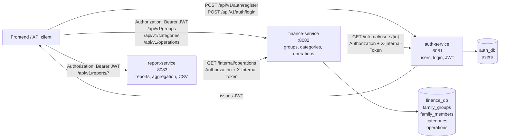
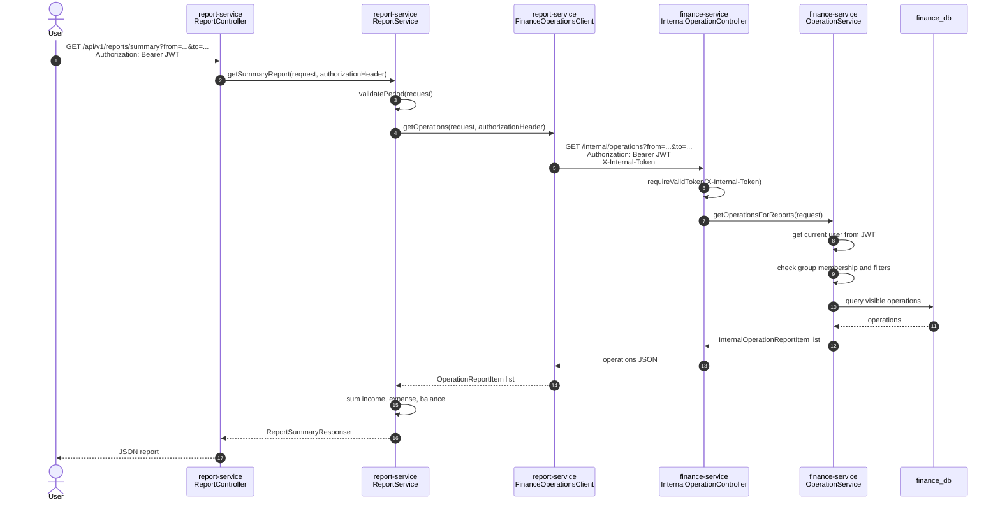
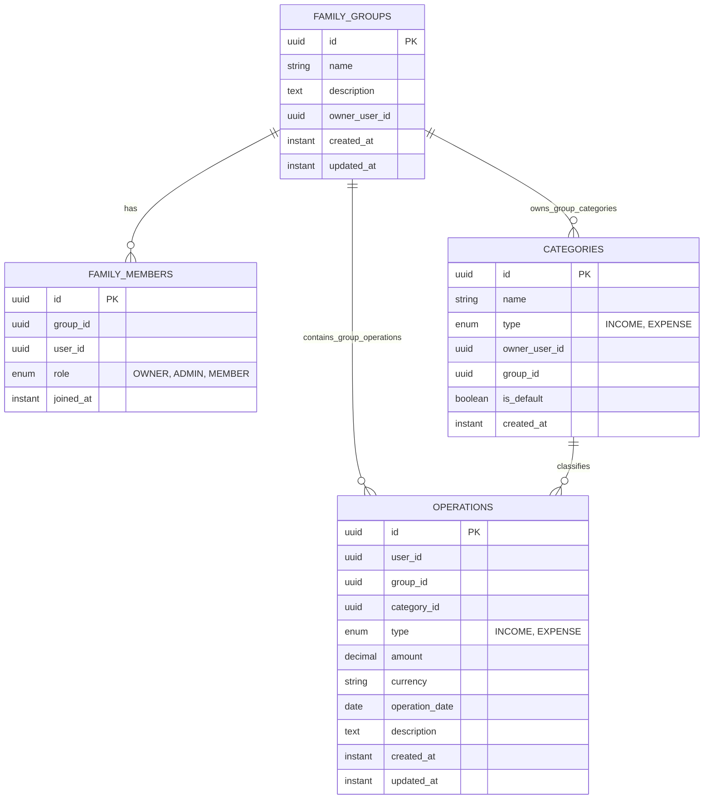
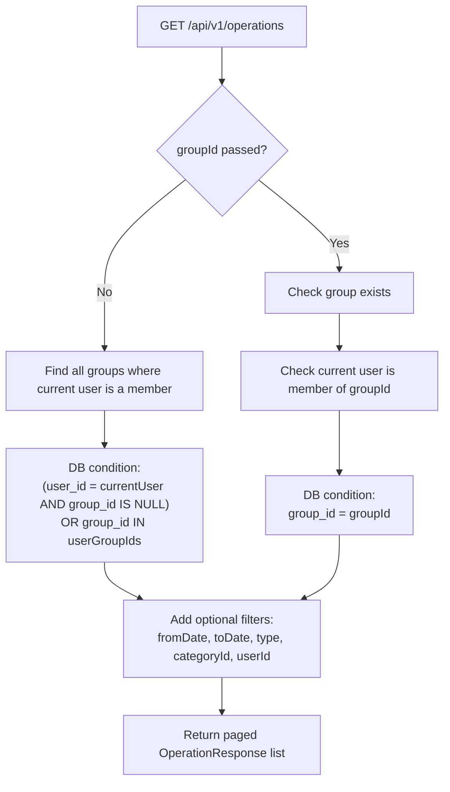

# Architecture Diagrams

Ниже несколько схем, которые помогают быстро увидеть, как устроено приложение и как сервисы связаны между собой.

## Service Map

## Report Request Flow

## Finance Data Model

## Operation Visibility Rule

